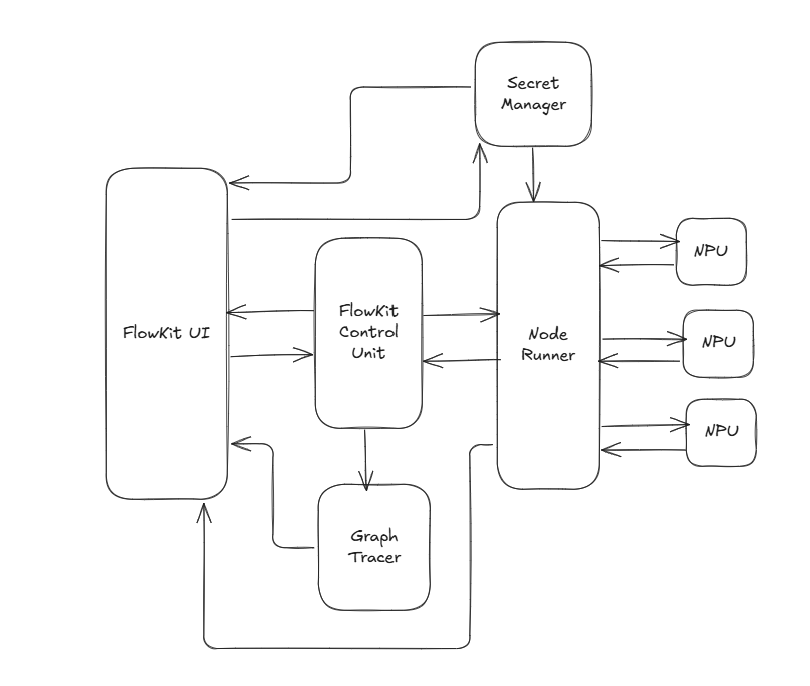
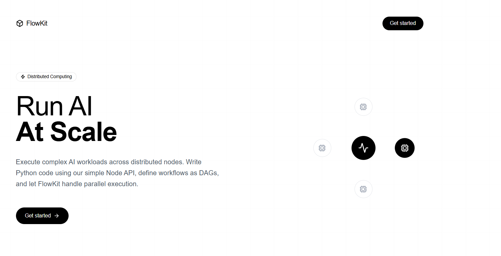
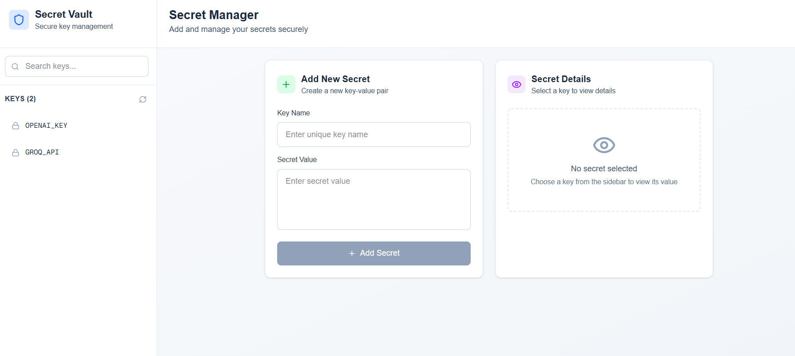
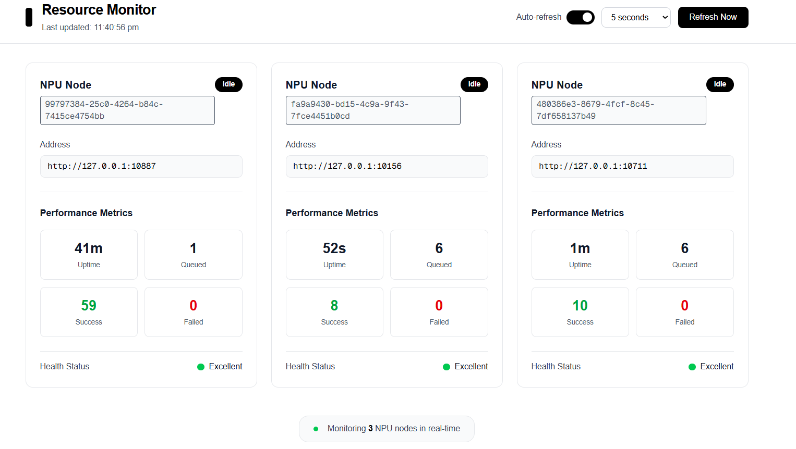

# FlowKit

<div align="center">

**A distributed AI code flow pipeline for building and executing graph-based workflows at scale**

[]()
[]()

</div>

---

## 🚀 Overview

FlowKit is a powerful distributed system that enables you to create AI pipelines using an intuitive graph-based interface. Design complex workflows visually, and let FlowKit handle distributed execution across worker nodes with automatic scaling and zero downtime.

### Key Features

- **Graph-Based Pipeline Design** - Build AI workflows visually with a drag-and-drop interface
- **Distributed Execution** - Automatically distribute workload across multiple worker nodes
- **High Availability** - Zero downtime with intelligent task scheduling and failover
- **Auto-Scaling** - Dynamically scale resources based on workload demands
- **Secret Management** - Secure storage and injection of API keys and sensitive data
- **Real-Time Monitoring** - Track execution paths, inputs, outputs, and system resources
- **Isolated Execution** - Run untrusted code safely in isolated VM environments

---

## 🏗️ Architecture

FlowKit consists of six core components working together to provide a robust distributed pipeline execution system:

### System Components

#### 1. **Node Processing Unit (NPU)**
The main worker node responsible for executing individual pipeline nodes. NPUs run in isolated VMs to safely execute remote code and process tasks.

#### 2. **Node Runner**
Acts as a bridge between NPUs and the FlowKit Control Unit. Responsibilities include:
- Task scheduling and distribution
- NPU management and monitoring
- Secret resolution from Secret Manager
- Health checks and failover handling

#### 3. **Secret Manager**
Secure storage for sensitive data such as API keys and credentials. Secrets can be referenced in node code using the syntax `{{{secret::KEY_NAME}}}`, which Node Runner resolves before execution.

#### 4. **Flow Trace Monitor**
Provides comprehensive observability by tracking:
- Node inputs and outputs
- Execution paths and timing
- Error logs and stack traces
- Performance metrics

#### 5. **FlowKit Control Unit**
The orchestration engine that executes pipelines. It maintains the Flow Control Block (FCB), which contains:
- Current execution state of all nodes
- Pipeline control flow logic
- Pause/resume/restart capabilities

#### 6. **FlowKit UI**
A web-based interface connecting users to all FlowKit services:
- Visual graph editor for pipeline design
- Secret management interface
- Real-time execution monitoring
- Resource utilization dashboards



---

## 📝 Quick Start

### Writing Your First Node

Nodes are the building blocks of FlowKit pipelines. Here's a simple example:

```python
from flowkit.node import Node
from flowkit.log import Logger

node = Node()
logger = Logger(node)

# Reference secrets using the secret manager syntax
api_key = "{{{secret::OPENAI_KEY}}}"

async def main():
    # Get inputs from previous nodes
    inputs = node.get_inputs()
    
    # Process data
    result = inputs["a"] + inputs["b"]
    
    # Log execution progress
    for i in range(10):
        await logger.info(f"Processing step {i}")
    
    await logger.info(f"Using API key: {api_key}")
    
    # Return: error_outputs, success_outputs, status_message
    return [], {"out": result, "key": api_key}, "run successfully"

# Register and run the node
node.register_main(main)
node.run()
```

### Node Return Format

```python
return nodes, success_outputs, status_message
```

- **nodes**: List of nodes which execute next
- **success_outputs**: Dictionary of outputs for successful execution paths
- **status_message**: Human-readable execution status

---

## 🎨 User Interface

### Pipeline Editor


Design complex AI workflows with an intuitive drag-and-drop interface. Connect nodes, configure parameters, and visualize your entire pipeline.

### Secret Manager


Securely manage API keys, credentials, and sensitive configuration data. All secrets are encrypted at rest and resolved at runtime.

### Resource Monitor
Monitor system health and resource utilization in real-time:

**Under Load**  


**Idle State**  
![Resource Monitor - No Load][/res/resource_monitor_noload.png]

Track CPU, memory, and network usage across all NPUs and make informed scaling decisions.

---

## 🔐 Security Features

- **Isolated Execution** - Each NPU runs in a separate VM for maximum security
- **Encrypted Secrets** - All sensitive data encrypted at rest and in transit
- **Access Control** - Role-based permissions for pipeline and secret management
- **Audit Logging** - Complete audit trail of all system operations

---

## 📊 Monitoring & Observability

FlowKit provides comprehensive monitoring through the Flow Trace Monitor:

- Real-time execution tracking
- Input/output inspection at every node
- Performance metrics and bottleneck identification
- Error tracking with detailed stack traces
- Historical execution data and analytics


<div align="center">

**Built with ❤️ for the AI community**

</div>